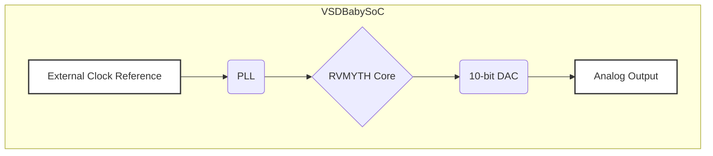

# Week-2 VSD Repo

## VSDBabySoC: An Open-Source RISC-V SoC for Learning and Experimentation

<div align="center"></div>

**VSDBabySoC** is a compact, open-source System on Chip (SoC) built on the Sky130 technology platform. Centered around the **RVMYTH RISC-V processor core**, this SoC integrates a **Phase-Locked Loop (PLL)** for precise clock generation and a **10-bit Digital-to-Analog Converter (DAC)** for interfacing with the analog world.

The primary mission of this project is to provide a fully transparent, highly documented, and educational platform for students, hobbyists, and professionals. It serves as a practical guide for learning digital-analog interfacing, open-source IP integration, and the complete RTL-to-GDSII flow. By converting digital signals into analog outputs, the VSDBabySoC can communicate with devices like televisions and mobile phones, enabling it to produce audio or video signals.

---

### ✨ Features

* **CPU:** RVMYTH 32-bit RISC-V Core (RV32I Base Integer Instruction Set)
* **Clocking:** On-chip PLL for stable, high-frequency clock synthesis from a low-frequency reference
* **Analog Interface:** Integrated 10-bit R-2R Ladder DAC for high-resolution analog signal generation
* **Technology:** Designed for the open-source SkyWater 130nm (SKY130) PDK
* **Open Source:** Fully open-source hardware, designed with open-source EDA tools
* **Educational:** Comprehensive documentation intended as a learning resource for SoC design

---

### 🎯 Project Goals

* **Integrate and Validate Open-Source IPs:** Serve as a platform to simultaneously test three distinct open-source IP cores: the RVMYTH CPU, a PLL, and a DAC.
* **Provide an Educational Tool:** Offer a clear and comprehensive example of a complete SoC design flow, from high-level architecture to physical layout and analog interfacing.
* **Bridge the Digital and Analog Worlds:** Demonstrate a practical application of a DAC within an SoC to control real-world analog devices.
* **Promote Open-Source Hardware:** Champion the use of the open-source RISC-V architecture and the Sky130 PDK to encourage community collaboration, innovation, and learning.

---

### 🏗️ System Architecture

The VSDBabySoC operates through a coordinated sequence of actions between its core components. The architecture is designed for simplicity and clarity, making it easy to understand the data flow from the processor to the analog output.



---

### ⚙️ Workflow

1. **Initialization and Clock Generation:** The PLL locks onto a reference clock and generates a stable, high-frequency signal to synchronize the system.
2. **Data Processing:** The RVMYTH core executes programs that load 10-bit digital values into a DAC-connected register.
3. **Analog Signal Generation:** The DAC converts each digital value into an analog voltage, driving devices like amplifiers or display inputs.

---

### 🧩 Core Components in Detail

#### RVMYTH (RISC-V CPU Core)

* **Architecture:** 32-bit, 3-stage pipeline
* **ISA:** RV32I base integer instruction set
* **Role:** Executes instructions, processes data, and manages memory-mapped I/O to the DAC

#### Phase-Locked Loop (PLL)

* **Function:** Generates a stable, precise on-chip clock.
* **Key Blocks:**

  * Phase Frequency Detector (PFD)
  * Charge Pump & Loop Filter
  * Voltage-Controlled Oscillator (VCO)
  * Frequency Divider
* **Why PLL:** Reduces jitter, ensures stability, and generates multiple frequencies from one external reference.

#### 10-bit Digital-to-Analog Converter (DAC)

* **Function:** Converts a 10-bit digital input into an analog voltage.
* **Resolution:** 1024 distinct levels.
* **Architecture:** R-2R Ladder design for simplicity and scalability.

---

### 🛠️ SoC Design and Verification Flow

#### Front-End Design (Logical Design)

* **Architecture Design:** Define system specifications and block diagrams.
* **RTL Design:** Write Verilog for all components.
* **Functional Verification:** Testbench simulation using Icarus Verilog, waveforms with GTKWave.

#### Back-End Design (RTL-to-GDSII)

* **Synthesis:** Use Yosys to create gate-level netlist.
* **Floorplanning & Power Planning:** Define layout and power grid.
* **Placement & Routing:** Done using OpenLane flow.
* **Clock Tree Synthesis (CTS):** Minimize skew.
* **Physical Verification:** DRC, LVS, and Antenna checks before tape-out.

---

### 🖼️ Physical Layout

* **Core Area:** XXX µm x XXX µm
* **Total Area:** XXX µm x XXX µm
* **Technology Node:** SkyWater 130nm
* **Standard Cell Count:** ~XXXX


---

### 🚀 Getting Started

#### Prerequisites

* Open-source EDA toolchain
* Icarus Verilog
* GTKWave
* OpenLane
* SkyWater 130nm PDK (sky130)

#### Clone the Repository

```bash
git clone https://github.com/your-username/vsdbabysoc.git
cd vsdbabysoc
```

#### Running the Simulation

```bash
cd verification/
iverilog -o testbench.vvp top_tb.v
vvp testbench.vvp
```

#### Synthesizing the Design

```bash
./flow.tcl -design vsdbabysoc
```

Refer to the OpenLane documentation for detailed setup.

---

### 🤝 How to Contribute

1. Fork the project
2. Create your feature branch (`git checkout -b feature/AmazingFeature`)
3. Commit your changes (`git commit -m 'Add some AmazingFeature'`)
4. Push to the branch (`git push origin feature/AmazingFeature`)
5. Open a Pull Request

---

### 📜 License

This project is licensed under the **Apache 2.0 License**. See the `LICENSE` file for details.

---

### 🙏 Acknowledgments

* The RVMYTH Core team
* Google & SkyWater for SKY130 PDK
* OpenLane developers
* The open-source hardware community
